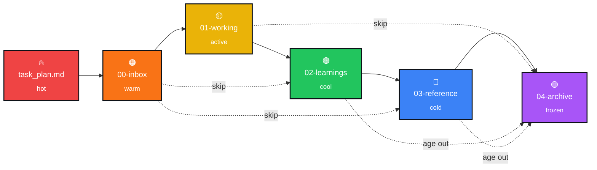

<div align="center">

<br/>

<picture>
  <source media="(prefers-color-scheme: dark)" srcset="assets/logo-dark.svg">
  
</picture>

# markup-foundations

*A point-in-time pillar on the best markup and tooling — for content authoring, agentic workflows, and knowledge platforms.*

<br/>

[**Notes →**](knowledge-base/) &nbsp;·&nbsp; [**Survey: keystroke-time expansion →**](knowledge-base/03-reference/keystroke-time-markup-expansion-landscape.md) &nbsp;·&nbsp; [**How notes mature →**](knowledge-base/README.md)

<br/>

</div>

## About

A **point-in-time pillar** on the best markup and tooling for content authoring — specifically for **agentic workflows**, **knowledge platforms**, and adjacent substrates. Picks winners. States positions. Calcifies as the ecosystem matures.

Scope: markdown core, Markdoc, MDX, HTML&#8209;in&#8209;markdown, shortcode lineage, keystroke&#8209;time expansion, SSG authoring stacks, and the editor&#8209;side tooling that sits underneath all of it.

---

## How notes mature (the gradient)

> [!NOTE]
> This is the internal folder convention for `knowledge-base/` — how raw captures move toward durable reference. **Not** the project's identity, just the organizational gradient.

Content flows **hot → cold** as it matures across five numbered zones. Solid arrows show the canonical path; dotted arrows show valid skips.



<table>
<thead>
<tr>
<th align="left">ZONE</th>
<th align="left">FOLDER</th>
<th align="left">CONTENTS</th>
<th align="left">LIFECYCLE</th>
</tr>
</thead>
<tbody>
<tr>
<td>🔥&nbsp;&nbsp;<sub><strong>HOT</strong></sub></td>
<td><code>task_plan.md</code></td>
<td>Optional session focus for multi&#8209;phase work</td>
<td><sub>this session</sub></td>
</tr>
<tr>
<td>🟠&nbsp;&nbsp;<sub><strong>WARM</strong></sub></td>
<td><code>00-inbox/</code></td>
<td>Raw captures, links, screenshots, unprocessed thoughts</td>
<td><sub>hours → days</sub></td>
</tr>
<tr>
<td>🟡&nbsp;&nbsp;<sub><strong>ACTIVE</strong></sub></td>
<td><code>01-working/</code></td>
<td>Drafts, forming opinions, comparison docs</td>
<td><sub>days → weeks</sub></td>
</tr>
<tr>
<td>🟢&nbsp;&nbsp;<sub><strong>COOL</strong></sub></td>
<td><code>02-learnings/</code></td>
<td>Distilled atomic insights &mdash; one per file, dated</td>
<td><sub>permanent</sub></td>
</tr>
<tr>
<td>🔵&nbsp;&nbsp;<sub><strong>COLD</strong></sub></td>
<td><code>03-reference/</code></td>
<td>Stable surveys, landscape docs, guides &mdash; actively consulted</td>
<td><sub>permanent</sub></td>
</tr>
<tr>
<td>🟣&nbsp;&nbsp;<sub><strong>FROZEN</strong></sub></td>
<td><code>04-archive/</code></td>
<td>Filed knowledge &mdash; loose or Johnny Decimal</td>
<td><sub>endpoint</sub></td>
</tr>
</tbody>
</table>

> [!TIP]
> **Gradient, not pipeline.** Content can *skip zones* — a clear insight goes straight to `02-learnings/`, a stable survey straight to `03-reference/`. Flow direction is always hot → cold; nothing ever heats back up.

---

## Current state

```
┌─ vault status ────────────────────────────────────────────────────────┐
│                                                                       │
│   ❯  tree -L 1 knowledge-base/                                        │
│                                                                       │
│      knowledge-base/                                                  │
│      ├── 🟠  00-inbox/         0 items                                │
│      ├── 🟡  01-working/       1 item    ← markdoc-vs-shortcode       │
│      ├── 🟢  02-learnings/     0 items                                │
│      ├── 🔵  03-reference/     2 items   ← landscape, sources         │
│      └── 🟣  04-archive/       0 items                                │
│                                                                       │
│   ❯  status                                                           │
│                                                                       │
│      version       0.1                                                │
│      vault         living                                             │
│      last review   2026-05-15                                         │
│      next due      when warm zones exceed 5 items                     │
│                                                                       │
└───────────────────────────────────────────────────────────────────────┘
```

---

## Layout

```
markup-foundations/
│
├── README.md                            ▸  you are here
├── CLAUDE.md                            ▸  conventions for agents and future-me
│
├── .claude/
│   └── skills/knowledge-curator/        ▸  gradient-placement nudges
│
├── .obsidian/                           ▸  minimal vault config
│
├── assets/
│   ├── logo.svg                         ▸  brand mark — light bg
│   └── logo-dark.svg                    ▸  brand mark — dark bg
│
├── templates/
│   ├── note.md                          ▸  minimal starter
│   └── frontmatter/                     ▸  capture + working examples
│
└── knowledge-base/                      ▸  all the content
    │
    ├── 🟠  00-inbox/                    raw captures
    ├── 🟡  01-working/                  drafts in flux
    ├── 🟢  02-learnings/                atomic insights
    ├── 🔵  03-reference/                stable surveys
    └── 🟣  04-archive/                  filed knowledge
```

---

## Scope & tenets

<details>
<summary><strong>Anything in the path from <kbd>keystroke</kbd> → rendered output</strong> for authored prose, slides, docs, and notes. Click to expand the layer breakdown.</summary>

<br/>

<table>
<thead>
<tr><th align="left">LAYER</th><th align="left">EXAMPLES</th></tr>
</thead>
<tbody>
<tr><td><strong>Markdown core</strong></td><td>CommonMark, GitHub&#8209;Flavored, Obsidian&#8209;Flavored, dialects</td></tr>
<tr><td><strong>Embedded markup</strong></td><td>Markdoc, MDX, Quarto, MyST</td></tr>
<tr><td><strong>Keystroke expansion</strong></td><td>Emmet, snippet engines, LaTeX Suite, Espanso</td></tr>
<tr><td><strong>Build&#8209;time shortcodes</strong></td><td>Hugo, Eleventy, Astro, Jekyll Liquid, Pandoc, RST</td></tr>
<tr><td><strong>HTML&#8209;in&#8209;markdown</strong></td><td>Patterns, escape rules, when to fall through</td></tr>
<tr><td><strong>Editor tooling</strong></td><td>Obsidian, VS Code, Zed, JetBrains, LSP&#8209;driven completion</td></tr>
</tbody>
</table>

</details>

> [!NOTE]
> **Out of scope** — full HTML/CSS specs, language&#8209;server implementation, general programming docs. Link out to authoritative references instead of mirroring them.

<br/>

<table>
<tbody>
<tr>
<td valign="top" width="48"><sub><strong>I.</strong></sub></td>
<td><strong>The source is the artifact.</strong><br/><sub>Plain text in the file outlives every renderer that ever touched it. Optimize for the source, not the build output.</sub></td>
</tr>
<tr>
<td valign="top"><sub><strong>II.</strong></sub></td>
<td><strong>Invented shortcode vocabularies rot.</strong><br/><sub>Project&#8209;local shortcode systems bind your source to a renderer you can't escape from. Prefer keystroke&#8209;time expansion or established specs like Markdoc.</sub></td>
</tr>
<tr>
<td valign="top"><sub><strong>III.</strong></sub></td>
<td><strong>Capture liberally, distill ruthlessly.</strong><br/><sub>The inbox is cheap. The learning is atomic. Don't let the warm zones become graveyards.</sub></td>
</tr>
<tr>
<td valign="top"><sub><strong>IV.</strong></sub></td>
<td><strong>Everything flows toward cold.</strong><br/><sub>Direction is always hot → cold. Nothing heats back up. Archive is the natural endpoint, not failure.</sub></td>
</tr>
<tr>
<td valign="top"><sub><strong>V.</strong></sub></td>
<td><strong>Link, don't duplicate.</strong><br/><sub>Wikilinks connect freely across zones. A reference doc cites its learnings; it doesn't restate them.</sub></td>
</tr>
<tr>
<td valign="top"><sub><strong>VI.</strong></sub></td>
<td><strong>Out&#8209;of&#8209;scope material gets linked, not mirrored.</strong><br/><sub>Don't reproduce the CommonMark spec here. Authoritative sources stay authoritative.</sub></td>
</tr>
</tbody>
</table>

---

## Seeded notes & lineage

Already in the vault — open these to see the format in practice.

<table>
<tbody>
<tr>
<td valign="top">🟡</td>
<td valign="top"><a href="knowledge-base/01-working/markdoc-vs-shortcode-systems.md"><code>01-working/markdoc&#8209;vs&#8209;shortcode&#8209;systems</code></a></td>
<td valign="top"><sub>Forming position on embedded markup — why invented shortcode systems rot and what wins instead.</sub></td>
</tr>
<tr>
<td valign="top">🔵</td>
<td valign="top"><a href="knowledge-base/03-reference/keystroke-time-markup-expansion-landscape.md"><code>03-reference/keystroke&#8209;time&#8209;markup&#8209;expansion&#8209;landscape</code></a></td>
<td valign="top"><sub>Full Layer 1–7 survey of the expansion ecosystem — abbreviation engines through local LLM runtimes.</sub></td>
</tr>
<tr>
<td valign="top">🔵</td>
<td valign="top"><a href="knowledge-base/03-reference/sources.md"><code>03-reference/sources</code></a></td>
<td valign="top"><sub>Annotated external&#8209;reference index. Where new external material lands.</sub></td>
</tr>
</tbody>
</table>

<br/>

Conventions for this repo — the temperature gradient, frontmatter, the `knowledge-curator` skill — are borrowed from the sibling [**`cybersader-agentic-workflow-and-tech-stack`**](https://github.com/cybersader/cybersader-agentic-workflow-and-tech-stack) scaffold so the same muscle memory and tooling carry over.

---

<div align="center">

<sub><strong>markup-foundations</strong> &nbsp;·&nbsp; v0.1 &nbsp;·&nbsp; living</sub>

</div>
